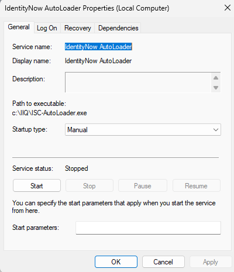
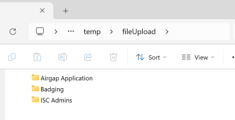
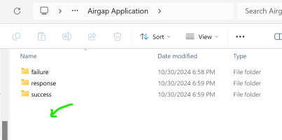
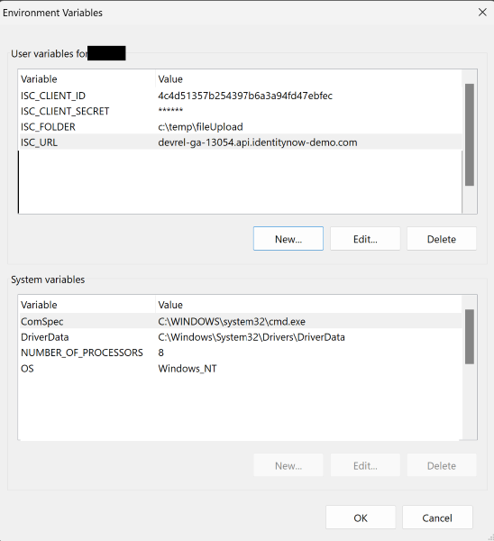
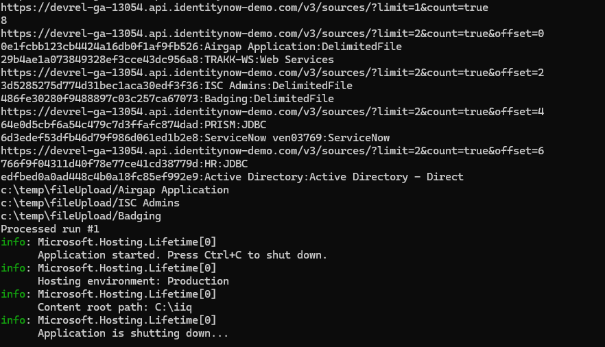

# IdentityNow_AutoLoader
IdentityNow ISC AutoLoader for Delimited Files.  A simple windows service to send csv files to IdentityNow.  Another project like this is https://github.com/sailpoint-oss/colab-file-upload-utility.  Use the colab repo if you need something that runs on Linux.  But if you need something that runs as a windows service like most traditional applications this might be the right code for you.  As it runs as a windows service the "Log On" and recovery options can be helpful.  




# Reason
The non cloud version could pick up files from your local ftp system or windows box.  As a customer you could schedule the pickup and use windows file protections that you normally use to secure any of your data.  IdentityNow is on a Cloud hosted solution therefore we need to detect when a file is created from an application report and upload over https.  The assumption is that must of your on-prem applications that produce reports for compliance are set to write to a windows file system.  


## Customer Upload Process
The code will connect to your instance of IdentityNow and create folders for each application that is a delimitted Application.  Inside the folder it will create three child folders. 

For account files simply add the file into the root of the folder for your source and wait for the system to process.  For entitlement the filename must start with ent-*

1) Success (Upload got a good response from the application)
2) Failure (Upload had some type of issue)
3) Response (http response code recieved from the upload command)

As an admin you will need to set the permissions correctly if you want to prevent one application owner from adding files to the wrong folder.  The Service account that runs the windows service will need read and write access.  When the application owner copies a file into root of the Folder drop box the system will scan and see the new file.  It will upload the file to IdentityNow and then move the file into one of the child folders with the date it was processed.  



# Setup/Install
You just need to define a few user variables. And DotNot Core 8x.  Remember this only works on Windows as its a Windows Service.  If you use system variables anyone with remote desktop to your server will have access but if you use user variables on the windows service account will have access.  

1) ISC_URL = tenant.API.identitynow.com
2) ISC_CLIENT_ID = PAT_ID value
3) ISC_CLIENT_SECRET = pat password
4) ISC_FOLDER = c:\fileUpload  (This is where all the application folders will be created)



### Optional config.ini
A config.ini file will be created.  This will contain optional configuration.  It is not required.  
``` ini
# Optional if you dont want to keep the history of uploaded files
archive=false
# System will scan upload and then rest.  In general this should be 60 as thats a min
delayScanPerSecond=3
# If you only want a subset of the applications instead of all delimited apps
limitList=Badging, ISC Admins
``` 

### Optional Locking
Some larger files may take time to be ftp'ed to your file server.  If this is the case have the report utility create file with the same name but with extention .lck or .lock.  This will tell the scanner that the file is open and not ready to upload.

## Validate
Before making this a windows service run locally to see how it works.  Just run the .exe command and you can see the processes and figure out if you have any issues such as network access issues.



```cmd 
./ISC-AutoLoader.exe
```

## Install as Windows Service
```cmd
sc create "IdentityNow AutoLoader" binPath=c:\IIQ\ISC-AutoLoader.exe
```

## UnInstall Windows Service
```cmd
sc delete "IdentityNow AutoLoader"
```

Hope this helps the community.  I have never tested it underload but its a very simple process.  If you run into load issues let me know the errors.    
Jed